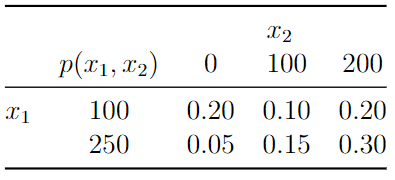
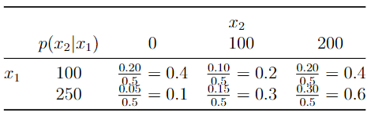
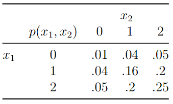

# Joint Distributions

## Jointly distributed discrete random variables

Suppose $X_1$ and $X_2$ denote two discrete random variables.  We want to compute the probability each takes a specific value *at the same time* or *simultaneously*.  Denote this *joint* probability by $P(X_1 = x_1, \, X_2 = x_2)$.  As we've previously seen, probabilities of discrete random variables behave just like probabilities of events, so this joint probability is analogous to $P(A\cap B)$.  Joint probabilities are assigned by a joint PMF.  In cases where the two (or more) random variables take on only finitely many values, their joint PMF can be displayed in a table.
  
Example: An insurance company randomly selects one of their customers and records $X_1$, the value of their deductible on their auto policy and $X_2$, the value of their deductible on their home policy.  Suppose the following PMF characterizes the joint probabilities of $(X_1, X_2)$: 

{width=20%}

Then, for example, the probability the customer's auto deductible is 250 and home deductible is 100 is $P(X_1 = 250, \, X_2 = 100) = p(250,100) = 0.15$.

In other cases joint PMFs may be derived using counting rules as the following example illustrates.    

Example: Previously we used counting rules to find the PMF of the number of heads (or tails) in $n$ flips of a coin with heads probability of $p$ (usually $p=1/2$).  That PMF is $p(x) = {n \choose x}p^x (1-p)^{n-x}$.  Now, suppose we roll a fair, six-sided die $n$ times, and let $X_1$ denote the number of 1's and $X_2$ denote the number of 2's.  What is the PMF of the probability we get $x_1$ 1's and $x_2$ 2's?  

Solution: The chance of rolling a 1 is 1/6, and so is the chance of rolling a 2.  So, provided $x_1 + x_2 \leq n$ we have $(\tfrac16)^{x_1}(\tfrac16)^{x_2}(\tfrac46)^{n-x_1-x_2}$ probability of any string of rolls of $x_1$ 1's, $x_2$ 2's, and remaining rolls.  Then, we have to count the number of ways of arranging said strings of rolls, and for this we use the formula for counting arrangements of distinguishable and indistinguishable objects --- that is, $\frac{n!}{x_1! x_2! (n-x_1 -x_2)!}$.  Therefore, the PMF is given by
\[p(x_1, x_2) = \frac{n!}{x_1! x_2! (n-x_1 -x_2)!}(\tfrac16)^{x_1}(\tfrac16)^{x_2}(\tfrac46)^{n-x_1-x_2}\]

### Marginal PMFs

Given a joint PMF $p(x_1, x_2)$ for r.v.'s $(X_1, X_2)$ we can *marginalize* to either r.v., meaning we can compute the probabilities associated with just one of them.  The ways we do this is by the law of total probability that we previously used to find probabilities of events using partitions.  The marginal PMF of $X_1$ given $p(x_1, x_2)$ is given by
\[p(x_1) = \sum_{x_2} p(x_1, \, x_2) = \sum_{x_2} P(X_1 = x_1, \, X_2 = x_2).\]
What we're doing here is partitioning the event $\{X_1 = x_1\}$ by values of $X_2$, i.e.,
\[\{X_1 = x_1\} = \bigcup_{x_2}\{\{X_1 = x_1\}\cap\{X_2 = x_2\}\}.\]
 
Example: The marginal PMF of auto deductible is given by
\[p(100) = p(100,0)+p(100,100)+p(100,200) = 0.20+0.10+0.20=0.50\]
\[p(250) = p(250,0)+p(250,100)+p(250,200) = 0.05+0.15+0.30=0.50\]
 

Example: In the die rolling example above we could find the PMF of the number of 1's by using the general formula. On the other hand it's easier if we recognize that the experiment in which we roll a die $n$ times and record the number of 1's is equivalent to a coin-slipping experiment with a biased/unfair coin.  Then, it must be that the PMF is
\[p(x_1) = {n \choose x_1}(\tfrac16)^{x_1}(\tfrac56)^{n-x_1}.\]

### Conditional PMFs

The conditional PMF $p(x_1|x_2)$ assigns probabilities to the events $\{X_1 = x_1\}$ within the sample space $\mathcal{S}\cap \{X_2 = x_2\}$.  Since probabilities of discrete random variables behave just like probabilities of events, we have
\[p(x_1|x_2) = \frac{p(x_1, \, x_2)}{p(x_2)},\]
i.e., the conditional PMF of $X_1$ given $X_2 = x_2$ is the ratio of the joint PMF to the marginal PMF of $X_2$.    

Example: The conditional PMF of home deductible given auto deductible is given by the following table.  And, notice the conditional PMF sums to 1 across rows because the rows represent the conditional sample spaces.

{width=40%}

 
Example:  Using the formula, we can compute the conditional PMF of the number of 2's in $n$ dice rolls given the number of 1's ($X_2$ given $X_1$).  
\begin{align*}
p(x_2|x_1) &= \frac{\frac{n!}{x_1! x_2! (n-x_1 -x_2)!}(\tfrac16)^{x_1}(\tfrac16)^{x_2}(\tfrac46)^{n-x_1-x_2}}{{n \choose x_1}(\tfrac16)^{x_1}(\tfrac56)^{n-x_1}}\\
& = \frac{\frac{n!}{x_1! x_2! (n-x_1 -x_2)!}(\tfrac16)^{x_1}(\tfrac16)^{x_2}(\tfrac46)^{n-x_1-x_2}}{\frac{n!}{x_1!(n-x_1)!}(\tfrac16)^{x_1}(\tfrac56)^{n-x_1}}\\
& = \frac{(n-x_1)!}{x_2!(n-x_1-x_2)!}(\tfrac16)^{x_2}(\tfrac46)^{n-x_1-x_2}(\tfrac65)^{n-x_1}\\
&=\frac{(n-x_1)!}{x_2!(n-x_1-x_2)!}(\tfrac14)^{x_2}(\tfrac45)^{n-x_1}\\
& = \frac{(n-x_1)!}{x_2!(n-x_1-x_2)!}(\tfrac14)^{x_2}(\tfrac45)^{n-x_1-x_2}(\tfrac{4}{5})^{x_2}\\
& = \frac{(n-x_1)!}{x_2!(n-x_1-x_2)!}(\tfrac15)^{x_2}(\tfrac45)^{n-x_1-x_2}
\end{align*}
In other words, the conditional distribution is the same as the probability of $x_2$ 2's in $n-x_1$ rolls of a fair five-sided die with no 1-side!

### Independence of discrete random variables

Two random variables $X_1$ and $X_2$ are independent if their conditional PMF (either one) is equal to the corresponding marginal PMF.  This implies the product rule holds, and that their Joint PMF is the product of their marginal PMFs.  That is,

\[p(x_1|x_2) = p(x_1)\quad\text{or, equivalently}\quad p(x_1,x_2)=p(x_1)p(x_2), \quad \forall (x_1,x_2).\]
 

Example: Let $X_1$ and $X_2$ denote score ranges for two players on a bowling team. suppose that if the player scores less than 100 they denote it with a zero, between 100 and 200 a 1 and better than 200 a 3.  Determine whether their performances are independent given their joint PMF:

{width=20%}

By summing over the rows we obtain the marginal PMF of $X_1$, given by $p(x_1) = 0.1,\, 0.4,\, 0.5$ for values $0$, 1, and 2, respectively.  Summing over columns we find the same marginal PMF for $X_2$.  Then, we have $p(0,0)  = 0.01 = 0.1\times 0.1 = p_{x_1}(0)p_{x_2}(0)$, $p(1,0) = 0.04 = 0.4\times 0.1 = p_{x_1}(1)p_{x_2}(0)$, etc.  If we check each of the 9 joint PMF values, we find that in **every case** the joint PMF equals the product of marginal PMF values.  Conclude $X_1$ and $X_2$ are independent.   

### Expectations involving multiple discrete random variables 

Let $g$ be a function involving two random variables $g:(X_1,X_2)\mapsto \mathbb{R}$.  Then, the expectation of $g(X_1,X_2)$ is given by
\[E(g(X_1,X_2)) = \sum_{x_1,x_2} g(x_1,x_2)p(x_1,x_2).\]

  

The covariance of $X_1$ amd $X_2$, denoted $Cov(X_1,X_2)$ is defined $E[(X_1 - E(X_1))(X_2 - E(X_2))]$ where $E(X_1)$ and $E(X_2)$ are the marginal expectations, i.e., $E(X_1) = \sum_{x_1} x_1 p(x_1)$.  Covariance may be equivalently defined $Cov(X_1, X_2) = E(X_1X_2)-E(X_1)E(X_2)$.  If $(X_1,X_2)$ are independent, then $Cov(X_1,X_2) = 0$.

  

Example: Find the covariance of auto and home deductibles. 
The marginal distribution of home deductible is $p(0) = 0.25$, $p(100) = 0.25$, and $p(200) = 0.50$.  Then, the mean values of $X_1$ and $X_2$ are $E(X_1) = 100*0.5 + 250 * 0.5 = 175$ and $E(X_2) = 125$.  The expectation of their product is 
\[E(X_1X_2) = 0*100*0.2 + 100*100*0.1 + 100*200*0.2 + 0.*250*0.05 + 100*250*0.15 + 200*250*0.30=23750\]
Their covariance is $23750-175*125 = 1875$.  

Like the variance, the covariance has units equal to the product of the units of $X_1$ and $X_2$, which may or may not be interpretable.  A unitless alternative to covarianceis *correlation* which divides covariance by the product of standard deviations of the random variables:
\[Corr(X_1, X_2) = \frac{Cov(X_1,X_2)}{\sigma_{X_1}\sigma_{X_2}}.\]
Like covariance, correlation is zero for independent random variables.  Unlike covariance, correlation is always between -1 and 1 and has no units.  This gives it a meaningful scale for interpretation across applications. 

 

Example: Find the correlation of auto and home deductibles. 
We need the variances of the auto and home deductibles, which we can compute by finding the second raw moments.
\[E(X_1^2) = 100^2*0.5 + 250^2 * 0.5 = 36250\]
So, $\sigma_{X_1}^2 = 36250-175^2 = 5625$.  And, 
\[E(X_2^2) = 100^2*0.25 + 200^2 * 0.5 = 22500\]
so that $\sigma_{X_2}^2 = 22500 - 125^2 = 6875$.
Their correlation is $1875/(\sqrt{5625*6875}) \approx 0.3015$.

